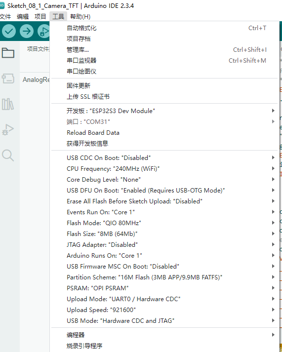

# ESP32S3-CAM_TFT
果云的esp32s3-cam驱动ov5640摄像头显示在ILI9341屏幕

代码很简单，主要是配置方面，采用的是Arduino IDE(感觉Arduino新版本的库没几个能用的~)

1.先根据lib\TFT_eSPI\User_Setup.h中针脚定义走线，再将lib中的文件全部替换到C:\xxx\xxx\Documents\Arduino\libraries中，也就是arduino默认的安装包路径中，

2.注意代码中tft pin脚定义不能和camera存在冲突，也就是不能共用一个pin脚

3.arduino安装esp32时版本不能是最新，我这里用的是2.0.9，否则烧录完成会一直重启 

效果展示:

